# simpledjango
 graphql

# 🔐 GraphQL JWT Authentication System - Documentation

این پروژه یک سیستم احراز هویت با استفاده از GraphQL و JWT است که شامل امکانات ثبت‌نام، ورود، دریافت توکن، رفرش توکن، و دریافت اطلاعات کاربر لاگین‌شده می‌باشد.

---

## ✅ قابلیت‌ها (Features)

| قابلیت                           | نیاز به توکن؟     | توضیح                                                                 |
|----------------------------------|--------------------|------------------------------------------------------------------------|
| ثبت‌نام کاربر (`createUser`)     | ❌                 | ایجاد حساب کاربری جدید و دریافت توکن و رفرش توکن                     |
| ورود با توکن (`tokenAuth`)       | ❌                 | ورود با نام کاربری و رمز عبور و دریافت access/refresh token          |
| رفرش توکن (`refreshAccessToken`) | ❌ (نیاز به refresh) | دریافت access token جدید با استفاده از refresh token                 |
| دریافت اطلاعات خود کاربر (`whoami`) | ✅               | گرفتن اطلاعات کاربری کاربر لاگین‌شده                                 |
| دریافت کاربر خاص (`user`)       | ✅                 | دریافت اطلاعات کاربر بر اساس ID، فقط برای کاربران لاگین‌شده         |
| بررسی توکن (`verifyToken`)       | ❌                 | بررسی اعتبار یک access token                                         |

---

## 🔧 Mutation‌ها و Query‌ها با مثال‌ها

### 🟢 1. ثبت‌نام (CreateUser)
```graphql
mutation {
  createUser(input: {
    username: "ali"
    email: "ali@example.com"
    password: "12345678"
  }) {
    ok
    token
    refreshToken
    user {
      id
      username
      email
    }
  }
}
```

### ✅ خروجی احتمالی
```json
{
  "data": {
    "createUser": {
      "ok": true,
      "token": "<access_token>",
      "refreshToken": "<refresh_token>",
      "user": {
        "id": "1",
        "username": "ali",
        "email": "ali@example.com"
      }
    }
  }
}
```

---

### 🟢 2. ورود (Login - tokenAuth)
```graphql
mutation {
  tokenAuth(username: "ali", password: "12345678") {
    token
    refreshToken
    payload
  }
}
```

### ✅ خروجی احتمالی
```json
{
  "data": {
    "tokenAuth": {
      "token": "<access_token>",
      "refreshToken": "<refresh_token>",
      "payload": {
        "username": "ali",
        "exp": 1714554063,
        "origIat": 1714550463
      }
    }
  }
}
```

---

### 🔄 3. رفرش توکن (RefreshAccessToken)
```graphql
mutation {
  refreshAccessToken(refreshToken: "<your_refresh_token>") {
    token
    refreshToken
    payload
  }
}
```

### ✅ خروجی احتمالی
```json
{
  "data": {
    "refreshAccessToken": {
      "token": "<new_access_token>",
      "refreshToken": "<new_refresh_token>",
      "payload": {
        "username": "ali",
        "exp": 1714554063,
        "origIat": 1714550463
      }
    }
  }
}
```

---

### 👤 4. دریافت اطلاعات کاربر لاگین‌شده (WhoAmI)
```graphql
query {
  whoami {
    id
    username
    email
  }
}
```

🟡 **نکته:** این Query نیاز به هدر دارد:
```
Authorization: JWT <access_token>
```

### ✅ خروجی احتمالی
```json
{
  "data": {
    "whoami": {
      "id": "1",
      "username": "ali",
      "email": "ali@example.com"
    }
  }
}
```

---

### 🔍 5. دریافت اطلاعات کاربر خاص (By ID)
```graphql
query {
  user(id: 1) {
    id
    username
    email
  }
}
```

🟡 **نکته:** نیاز به Authorization header دارد.

### ✅ خروجی احتمالی
```json
{
  "data": {
    "user": {
      "id": "1",
      "username": "ali",
      "email": "ali@example.com"
    }
  }
}
```

---

### 🔐 6. بررسی اعتبار توکن (VerifyToken)
```graphql
mutation {
  verifyToken(token: "<your_token_here>") {
    payload
  }
}
```

### ✅ خروجی احتمالی
```json
{
  "data": {
    "verifyToken": {
      "payload": {
        "username": "ali",
        "exp": 1714554063,
        "origIat": 1714550463
      }
    }
  }
}
```

---

## 📌 نکات امنیتی و پیاده‌سازی

- هنگام ارسال `Authorization` حتماً فرمت آن باید `JWT <token>` باشد.
- توصیه می‌شود توکن‌ها را در سمت کلاینت در `httpOnly cookie` ذخیره کنید یا از راه‌های امن استفاده نمایید.
- `refreshToken` باید در سرور یا سمت کلاینت امن ذخیره شود و نباید در لوکال‌استوریج نگهداری گردد.

---

## 📁 ساختار GraphQL

- Query Root: `AccountsQuery`
- Mutation Root: `AccountsMutation`

شما می‌توانید این موارد را در schema اصلی با استفاده از:
```python
schema = graphene.Schema(query=AccountsQuery, mutation=AccountsMutation)
```
تعریف کنید.

---

اگر نیاز به افزودن قابلیت‌هایی مثل بروزرسانی کاربر، حذف، یا تغییر رمز عبور دارید، قابلیت گسترش آسان در ساختار فعلی وجود دارد. فقط کافیست Mutation‌های جدید تعریف کنید.

---

تهیه شده برای توسعه‌دهندگان GraphQL با Django & JWT ❤️
<!-- ------------------------------------------------------- -->

# 🟢 1. ثبت‌نام کاربر جدید
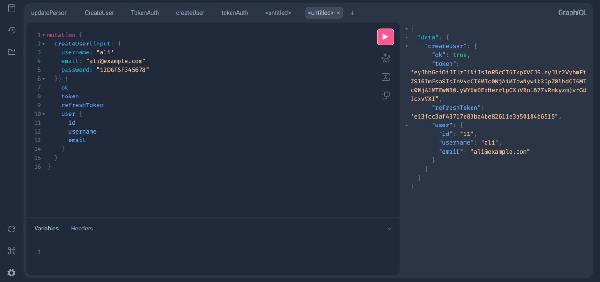

# ✅ 2. ورود و دریافت توکن (CustomObtainJSONWebToken)

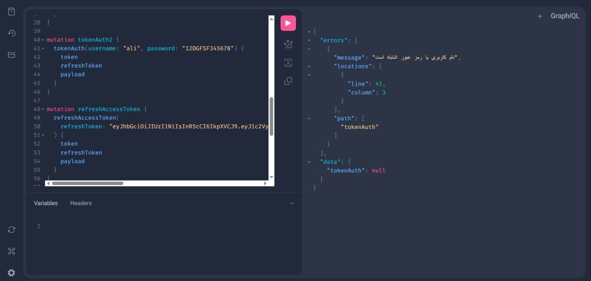

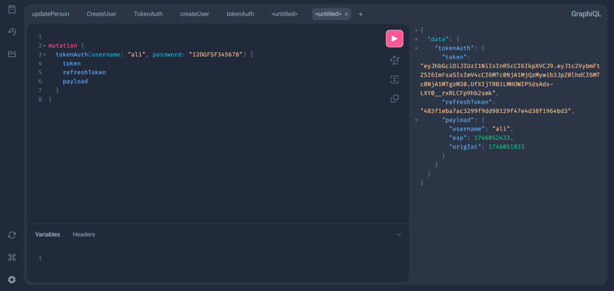

# ✅ 3. رفرش توکن و دریافت توکن جدید (RefreshAccessToken)

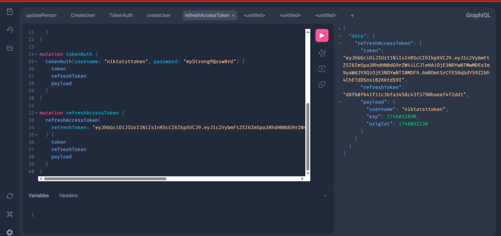

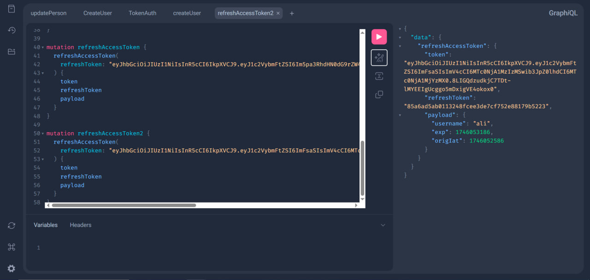

# ✅ 4. گرفتن اطلاعات کاربر لاگین‌شده (whoami)

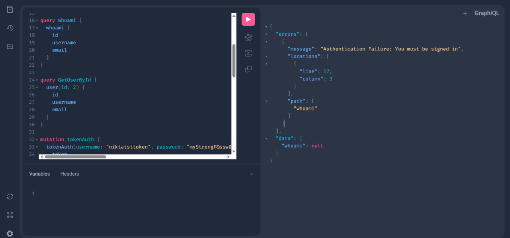

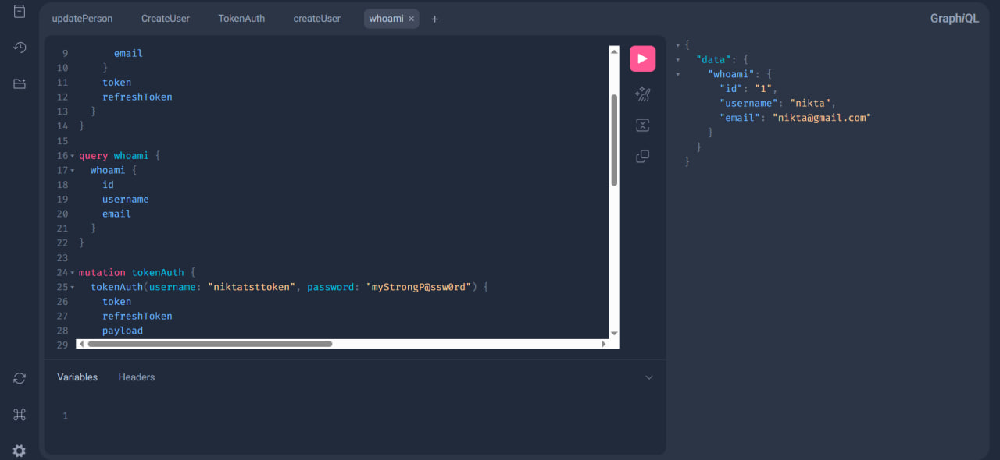

# ✅ 5. گرفتن اطلاعات یک کاربر خاص با شناسه (user)

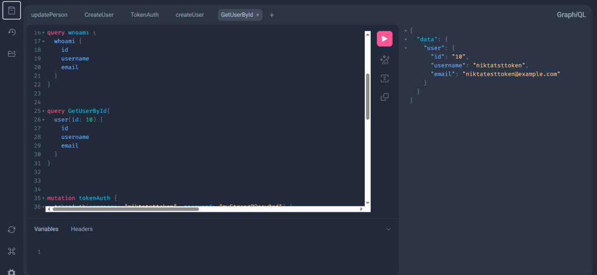

# 🔁 6. بررسی اعتبار توکن (Verify)

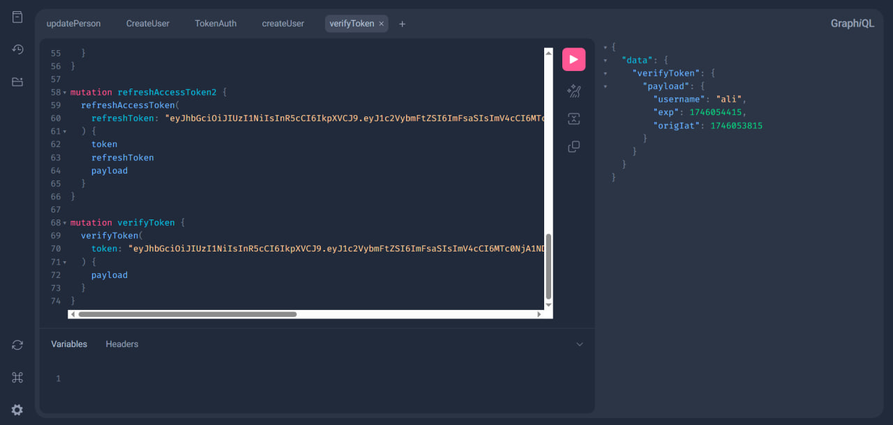

# 7
وقتی با اکانت علی وارد بشم بهش نمایش نمیده اطلاعات یوزر رو بر اساس ایدی ولی وقتی با اکانت سوپر یوزر داخل ادمین جنگو لاگین بودم چون مرورگر هنوز از کوکی session نیکتا استفاده می‌کرد نمایش همه ایدی ها و اطلاعاتشونو می داد ولی توی تب Incognito نمیاره یا اگر لاگ اوت کنم


# 8 پروفایل رو میتونه اپدیت کنه و عکس بذاره
{
    "data": {
        "updateUser": {
            "ok": true,
            "user": {
                "id": "2",
                "username": "niktatsttoken",
                "email": "nikta.test@example.com",
                "firstName": "Nikta",
                "lastName": "Test",
                "profilePicture": "",
                "gender": "FEMALE",
                "position": "Developer",
                "department": "Tech"
            }
        }
    }
}

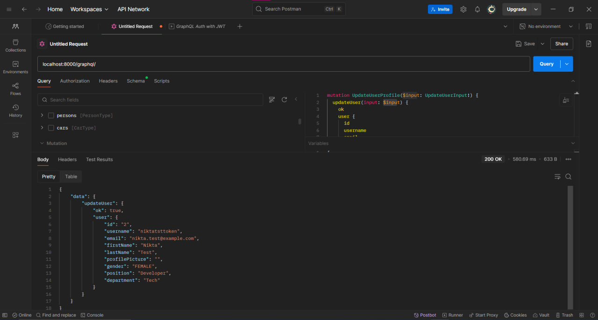

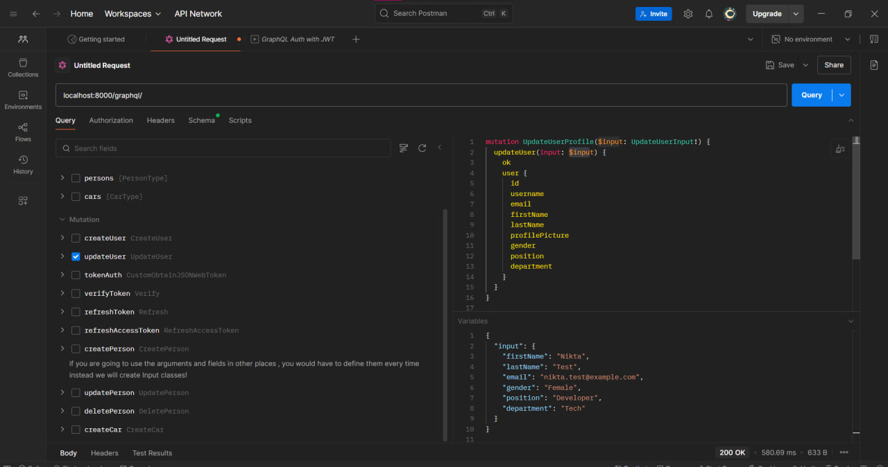


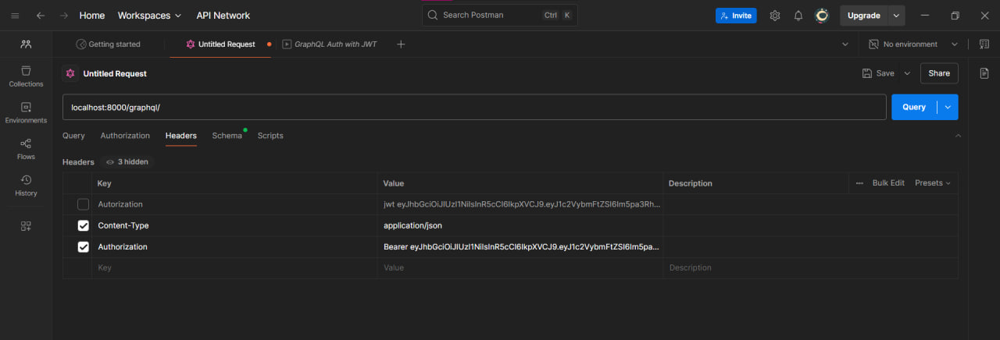


mutation UpdateUserProfile($input: UpdateUserInput!) {
  updateUser(input: $input) {
    ok
    user {
      id
      username
      email
      firstName
      lastName
      profilePicture
      gender
      position
      department
    }
  }
}

mutation tokenAuth {
  tokenAuth(username: "niktatsttoken", password: "myStrongP@ssw0rd") {
    token
    refreshToken
    payload
  }
}


variabels:

{
  "input": {
    "firstName": "Nikta",
    "lastName": "Test", 
    "email": "nikta.test@example.com",
    "gender": "Female",
    "position": "Developer",
    "department": "Tech"
  }
}


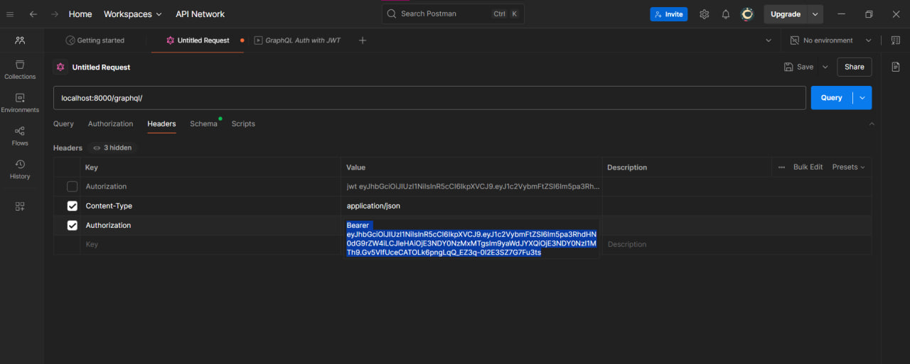


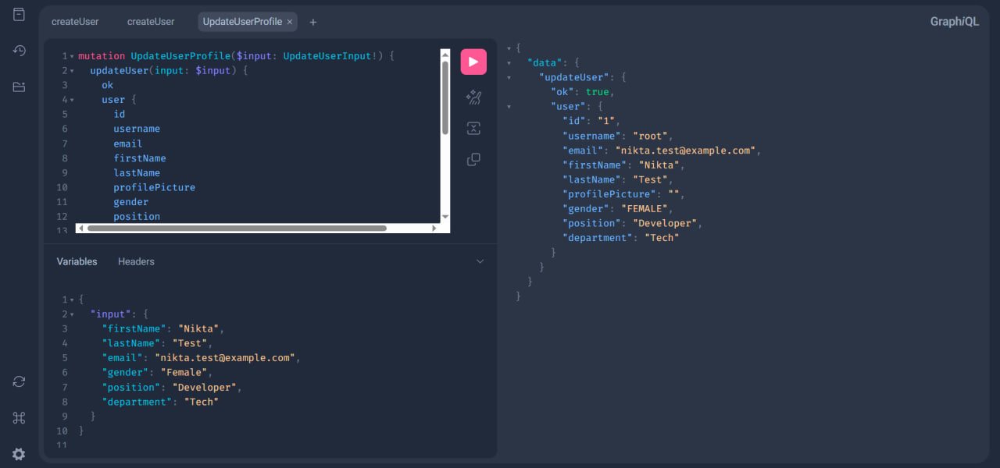

# 9 میبینیم که داخل ادمین پنل هم تغییرات انجام شد

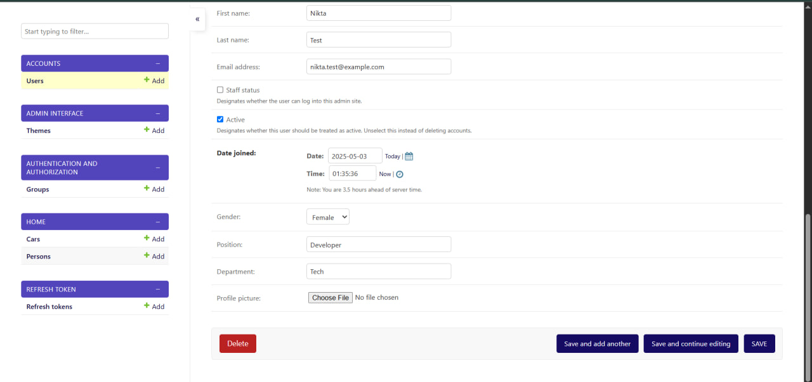

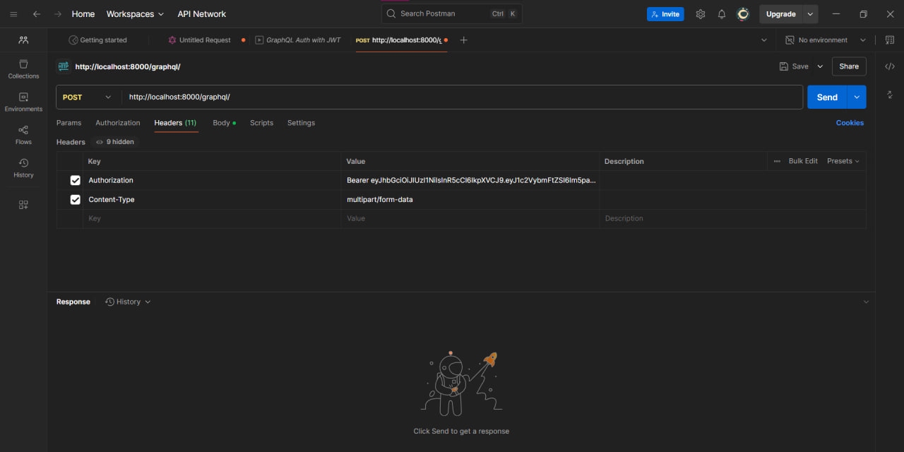

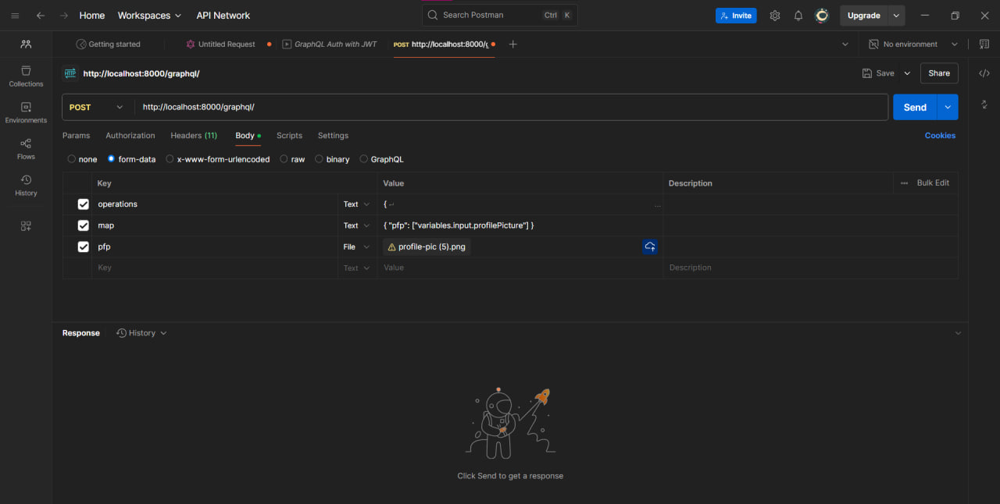

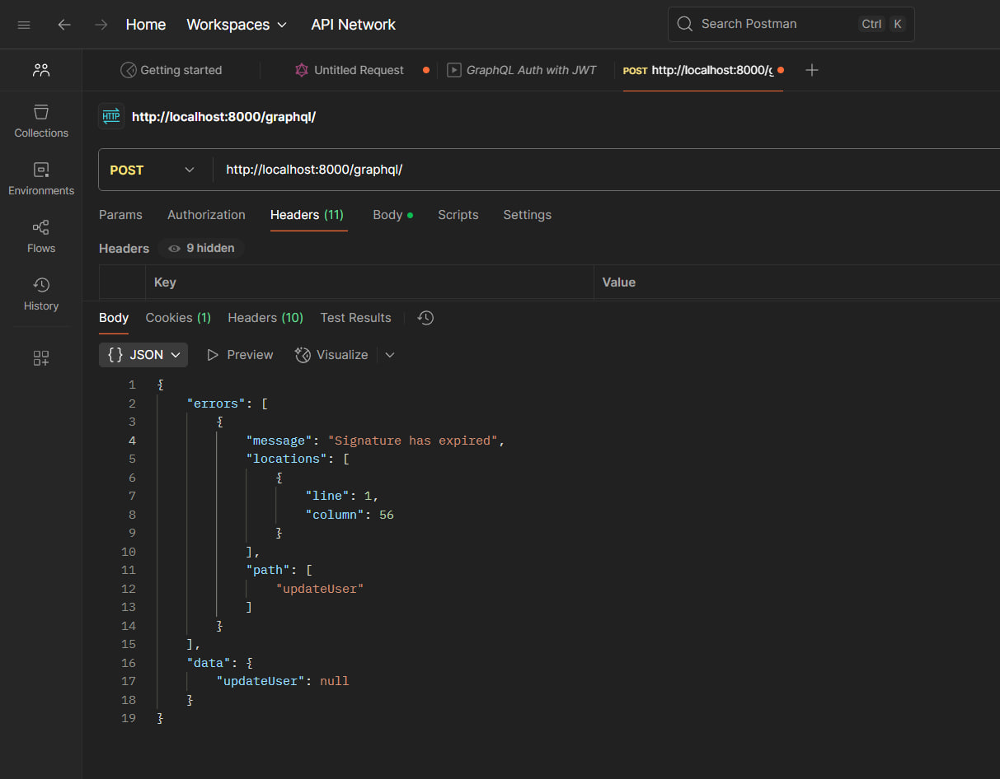


{
    "data": {
        "updateUser": {
            "ok": true,
            "user": {
                "id": "2",
                "username": "niktatsttoken",
                "email": "nikta.test@example.com",
                "firstName": "Nikta",
                "lastName": "Test",
                "profilePicture": "profile_pics/profile-pic_5.png",
                "gender": "FEMALE",
                "position": "Developer",
                "department": "Tech"
            }
        }
    }
}


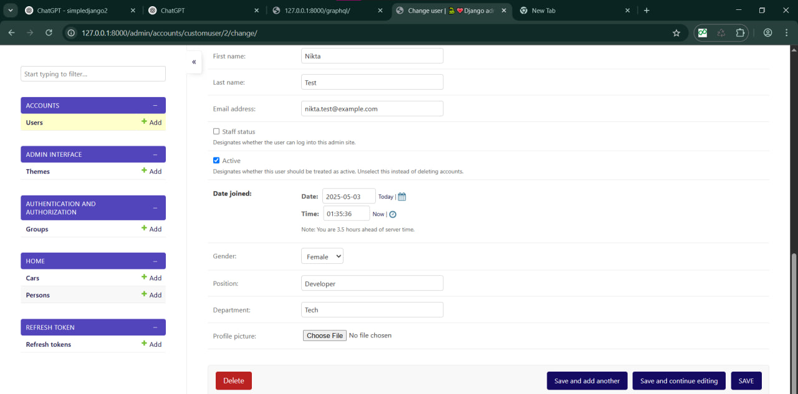

# 10 همونطور که مشخصه بعد از بارگزاری و ارسال درخواست تو ادمین پنل فایلش اومده و داخل فولدر مدیای(media) برنامه هم سیو شده


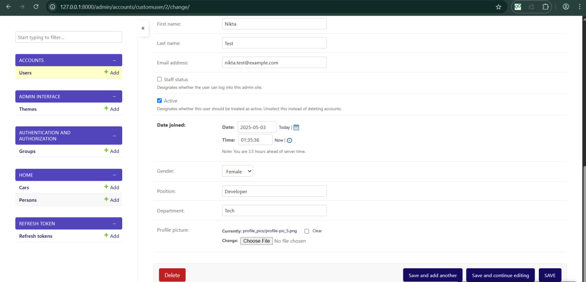


# 11 ادامه در # راهنمای تست API مدیریت وظایف در Postman


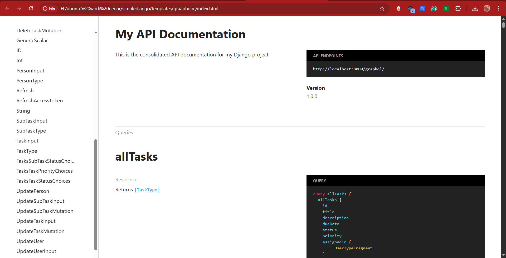


